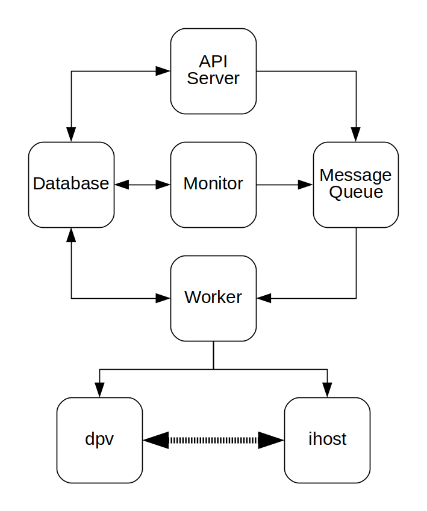
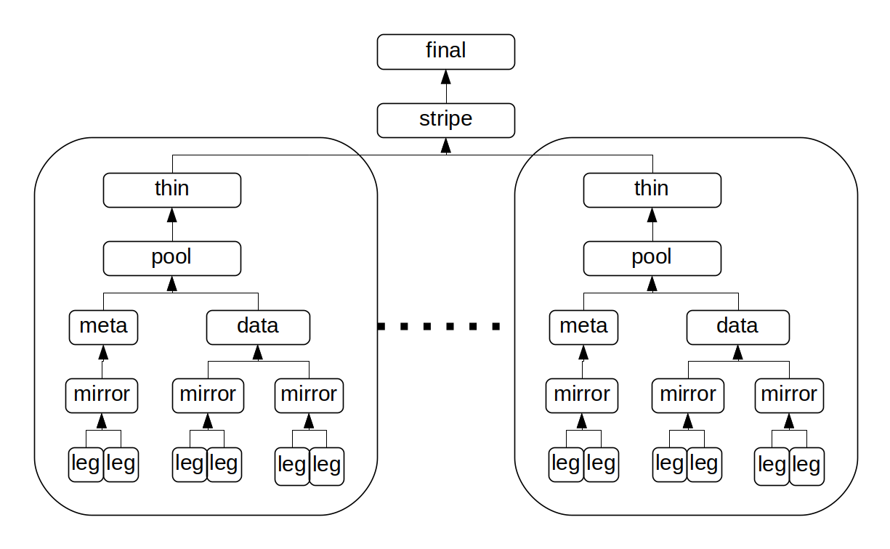
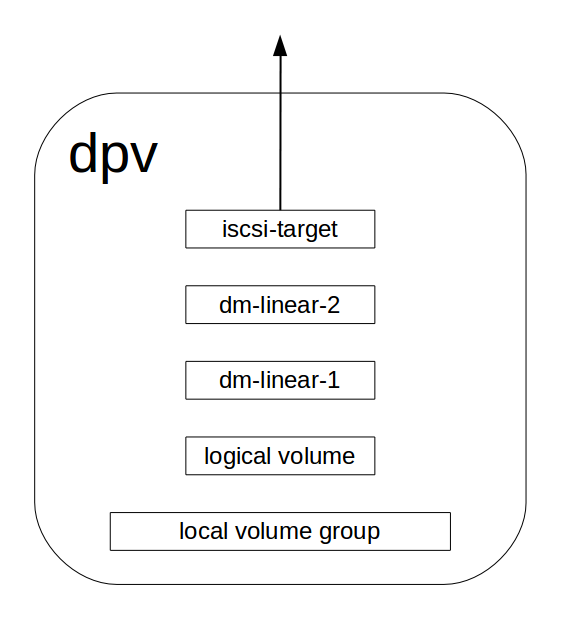

Introduce to DLVM
=================

DLVM (Distribute Logical Volume) is a distribute storage system,
intends to be a storage backend for a cloud platform, such as
openstack cinder.

DLVM features:

* REST api interface
* supports create/delete volume, attach/detach volume, create/delete
  snapshot, online clone, increase volume size
* HA (provided by device mapper mirror target)
* thin provision (provided by device mapper thin provision target)
* more than 100K IOPS random write per volume

DLVM has similar concepts as traditional `LVM`_. The traditional
`LVM`_ has pv (physical volume), vg (volume group) and lv (logical
volume), DLVM has the corresponding conecpts which are dpv, dvg and
dlv, the characture 'd' is the abbreviate of 'distribute'. In DLVM, a
dpv is a linux server which can export volume(s) through iscsi. A dvg
is a group of dpvs, a dlv is a logical aggregation of dpvs in a same
dvg. A dlv can be attached to an ihost(initiator host) through iscsi
protocol.
Below is the architecture of the dlvm service:

There are several components of the dlvm services:

* API Server: provides restful api, such as create volume, attach volume
  and so on. API Server will only record the request to Database, and
  send a message to Message Queue, a Worker will get this request and
  actually work on it
* Worker: accepts requests from Message Queue, sends rpc to dpv or ihost,
  updates the status in Database.
* dpv: storage server, runs dlvm_dpv_agent on it, accepts rpc call from
  API Server or Worker, creates volume or exports voluem to ihost
* ihost: the host which the dlv can be attached to, runs
  dlvm_ihost_agent on it, accepts rpc call from Worker.
* Monitor: runs celery beat on it, sends periodic tasks to Worker
* Database: currently only test mariadb, should be any DB supportted
  by SQLAlchemy
* Message Queue: rabbitmq or any message queues support by celery

Below picture is the dlv structure when it is attached to an ihost:

The dlv is divided to several groups, a group has several legs,
every leg is an iscsi device allocated from a dpv.

below picture is the internal strucutre of a leg in dpv:

.. _LVM: https://en.wikipedia.org/wiki/Logical_Volume_Manager_%28Linux%29
