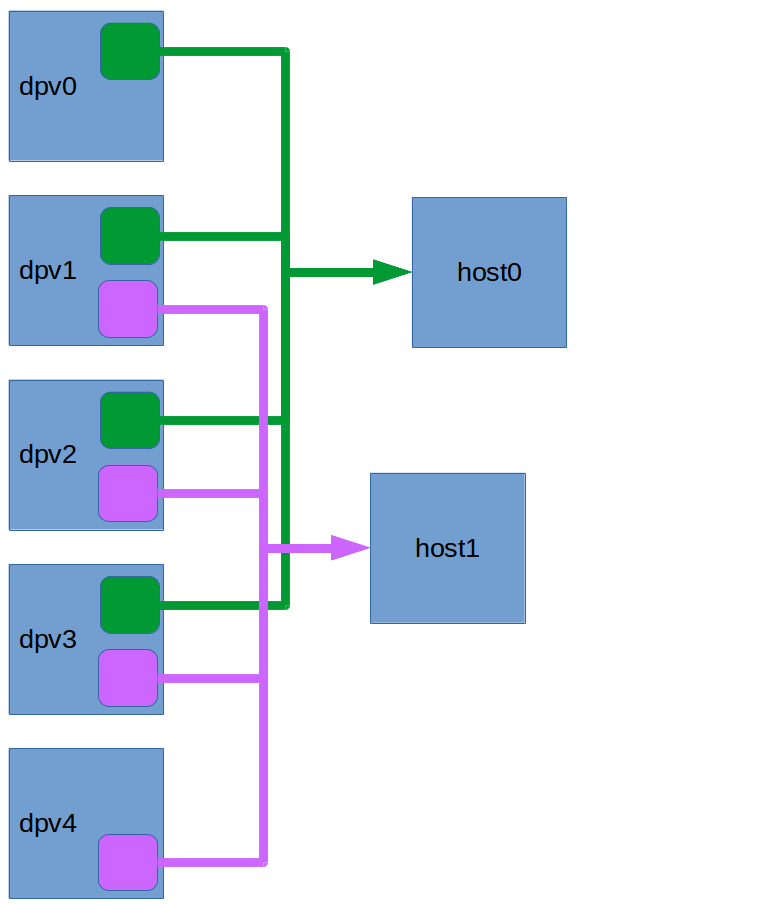
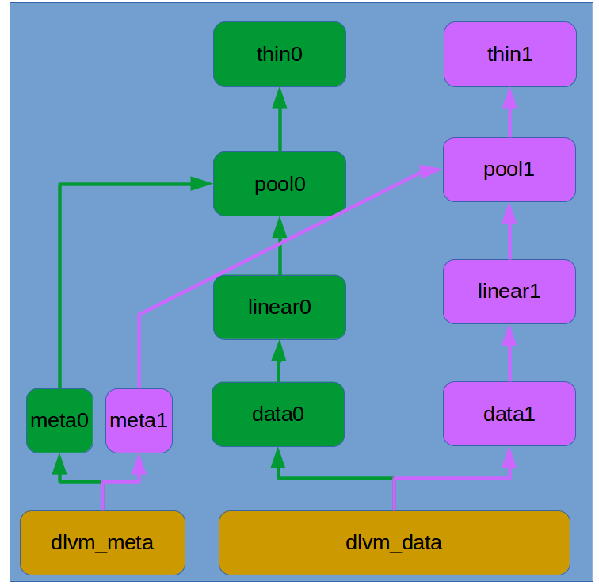

Introduction to DLVM
====================

DLVM (Distribute Logical Volume) is a distribute storage system,
intends to be a storage backend for a cloud platform, such as
openstack cinder.

DLVM features:

* REST api interface
* supports create/delete volume, attach/detach volume, create snapshot
  from a volume, increase/decrease volume size
* provide HA by LVM mirror
* provide high performance by LVM stripe

DLVM has similar concepts as traditional `LVM`_. The traditional
`LVM`_ has pv (physical volume), vg (volume group) and lv (logical
volume), DLVM has the corresponding conecpts which are dpv, dvg and
dlv, the characture 'd' indicate distribute. In DLVM, a dpv is a linux
server which can export volume(s) through iscsi. A dvg is a group of
dpvs, a dlv is a logical aggregation of dpvs in a same dvg. A dlv can
be attached to a host. On the host, every two dpvs of the dlv will be
aggregated to a device mirror target, and all the device mapper mirror
targets will be aggregated to a device mapper stripe target. The
finally stripe target can be used as a block device on the host. Below
image is a simple example:

.. figure:: image/basic.png

   simple example

The four dpvs belong to a same dvg, each dpv has a logical
volume on their local LVM volume group, and they export their logical
volume through iscsi, connect to host. On host, the lun on dpv0 and
dpv1 will aggregate as a device mapper mirror target, dpv2 and dpv3 will
aggregate as a device mapper mirror target, then the two mirror
targets aggregate as a device mapper stripe target. Host can use the
stripe target as a block deivce.

Here is a more complex:

The five dpvs belong to a dvg, and we have two dlv, one dlv is
attaching to host0, another dlv is attaching to host1. The first dlv
has 4 legs, they are on dpv0, dpv1, dpv2 and dpv3, the second dlv has
for legs too, but they are on dpv1, dpv2, dpv3 and dpv4. One dpv can
contribute to multiple dlvs. A dpv will create a logical volume on its
local volume group for every leg, and when attach a dlv to a host, the
dpv will export the leg through iscsi.

To understand the detail of a dpv, you should have basic knowledge
about lvm and several targets of linux device mapper: linear,
thin-provision. Every dpv should have two volume groups: dlvm_meta and
dlvm_data. When create a dlv, the user should specific a stripe_number
of the dlv, every stripe is a device mapper mirror, so the total leg
number is stripe_number * 2, then dlvm will select stripe_number * 2
dpvs, create legs on each dpv. Every dpv has two lvm volume groups:
dlvm_meta and dlvm_data. When create a leg, dlvm will create a logical
volume on dlvm_meta, it will used for the thin-pool metadata device, and
create a logical volume on dlvm_data, then create a device mapper
linear target on it, the linear target will be used for the thin-pool
data device. Then create a thin-pool target, and create a thin target
in the thin-pool. The thin target will be used as the leg, it will be
exported through iscsi. Below image shows the internal detail of a
dpv:

The above image showns a dpv has two legs on it. A dpv can have many
legs, they should belong to different dlvs.

As dlvm use thin-pool target on dpv, it get two benefits provided by
thin-pool:

#. create a big dlv with less physical resource, only allocate new
   physical resource when required
#. snapshot

When allocate a leg on a dpv, the leg should have two attributes:
virtual_size and actual_size. The virtual_size is the size expected by
the user, the actual_size is the actual disk used on the dpv, it equal
to the size of the lv allocated from dlvm_data. A dpv will also has a
virtual_size and an actual_size. The actual_size is the current size
of dlvm_data volume group, the virtual_size is the max size of the
dlvm_data could be extend to.

.. _LVM: https://en.wikipedia.org/wiki/Logical_Volume_Manager_%28Linux%29
