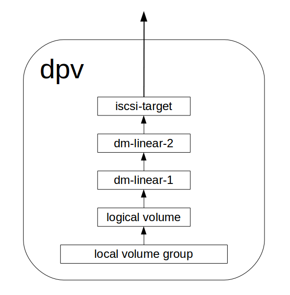

Introduce to DLVM
=================

DLVM (Distribute Logical Volume) is a distribute storage system,
intends to be a storage backend for a cloud platform, such as
openstack cinder.

DLVM features:

* REST api interface
* supports create/delete volume, attach/detach volume, create/delete
  snapshot, online clone, increase volume size
* HA (provided by device mapper mirror target)
* thin provision (provided by device mapper thin provision target)
* more than 100K IOPS random write per volume

DLVM has similar concepts as traditional `LVM`_. The traditional
`LVM`_ has pv (physical volume), vg (volume group) and lv (logical
volume), DLVM has the corresponding conecpts which are dpv, dvg and
dlv, the characture 'd' is the abbreviate of 'distribute'. In DLVM, a
dpv is a linux server which can export volume(s) through iscsi. A dvg
is a group of dpvs, a dlv is a logical aggregation of dpvs in a same
dvg. A dlv can be attached to an ihost(initiator host) through iscsi
protocol.
Below is the architecture of the dlvm service:

There are 6 components of the dlvm services:

* API Server: provide restful api, stateless
* DB: database, sqlite (only for test propuse), postgresql,
  mysql/mariadb
* dpv: storage server, run dlvm_dpv_agent, accept rpc call from api
  server, export volume to ihost
* ihost: the host which the dlv can be attached to run
  dlvm_ihost_agent, accept rpc call from api server
* Message Queue: rabbitmq or redis
* Monitor: get information from message queu, e.g. a leg of dlv is
  failed, trigger a failover job

Below picture is the dlv structure when it is attached to an ihost:

.. figure:: image/ihost.png
   :scale: 50%

The dlv is divided to several groups, a group has several legs,
every leg is an iscsi device allocated from a dpv. When create a dlv,
it will have only two groups, one for thin-provision metadata (group 0
in the above picture), another for the thin-provision data (group 1 in
the above picture). When the data is not enough, ihost will send a
message to the message queue, then the monitor program can create an
extend job to add a new group to the dlv.

below picture is the internal strucutre of a leg in dpv:

.. _LVM: https://en.wikipedia.org/wiki/Logical_Volume_Manager_%28Linux%29
