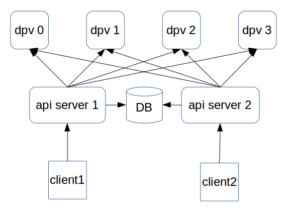

Owner Based Transaction
=======================

The dlvm api server has its own method to handle the concurrent
request with the same dlv. That method is OwnerBasedTransaction (obt
for short).

=========================
external interface of obt
=========================

Before operate a dlv, create an obt, the obt has three parameters,
t_id indicate the obt, t_owner indicate the api caller, t_stage is a
helper field which indicate which stage the obt is::

  $ curl -H "Content-Type: application/json" -X POST -d '{"t_id":"t0","t_owner":"owner0","t_stage":0}' http://localhost:9521/obts

When call a dlvm api which may modify the status of a dlv, the client
should pass the t_id, t_owner and t_stage to the api, e.g. when create
a dlv::

  $ curl -H "Content-Type: application/json" -X POST -d '{"dlv_name":"dlv0","dlv_size":3000000000,"init_size":1000000000,"stripe_number":1,"dvg_name":"dvg0","t_id":"t0","t_owner":"owner0","t_stage":1}' http://localhost:9521/dlvs

When a dlv is associate with an obt, other client can not operate the
dlv, when another client want to modify the dlv, it should preempt the
obt, when premeet the obt, the client should assign a new t_owner::

  $ curl -H "Content-Type: application/json" -X PUT -d '{"t_owner":"owner0","new_owner":"owner1","action":"preempt"}' http://localhost:9521/obts/t0

Then the client can operate the dlv, e.g., delete it::

  $ curl -H "Content-Type: application/json" -X DELETE -d '{"t_id":"t0","t_owner":"owner1", "t_stage":2}' http://localhost:9521/dlvs/dlv0

After all operations, you can delete the obt::

  $ curl -H "Content-Type: application/json" -X DELETE -d '{"t_owner":"owner1"}' http://localhost:9521/obts/t0

The dlvm python sdk and commandline tool has implement obt internally,
so you don't need to create/delete obt manually.

============================
internal implemention of obt
============================

Below is a typical concorrent condition:

When client 1 wants to attach a dlv to an ihost, client 1 sends api to
api server 1, then api server 1 will generate rpc call to several
dpvs, e.g. dpv 0, dpv 1, dpv 2 and dpv 3, and in fact, api server 1
should also contact to an ihost, but omit it for simple, and api
server 1 will also set the dlv status to 'attached' in the database
afer completes all rpc calls. For some reaons, api server 1 hung,
another client wants to call detach api to withdraw the
attachment. Then client 2 calls detach api to api server 2, api server
2 will generate rpc call to dpv 0, dpv 1, dpv 2 and dpv 3 (and an
ihost), and set the dlv status to 'detached' in the db after completes
all rpc calls. We don't have a method to fence api server 1, after
api server 2 completes all its actions, api server 1 may sends rpc
calls for the attachment again, so we shold have a method let dpv and
db reject the request of api server 1.

The obt resolve this problem from two parts:

1. The rpc call will associate with a count number, the count numer
   will increase globally for every rpc call. The dpv and ihost will
   store the max count number for every resources, when it receives a
   rpc call, it compare the rpc call's count number with the max count
   number, if the rpc call's count number is smaller than the max
   count number, it will reject the request

2. Every time the api server want to update database, it lock the line
   of obt in database, check its owner is correct, when another api
   server want to update the obt count number, it must lock the obt
   again, and if it can lock successful, the previous api server's
   lock must expired, the transaction of the previous api server won't
   successful, so after the later api server lock the obt, the
   previous api server can't submit its change to the database.
